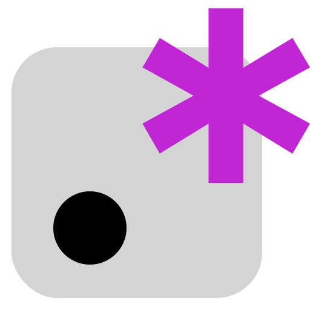

<p align="center">
  <a href="https://nexthis.github.io/leregexp/">
    
  </a>
</p>
<h1 align="center">
  LeRegExp
</h1>
<p align="center">
  Unlock the Power of Pattern Matching
</p>
<p align="center">
  <a href="https://github.com/nexthis/leregexp/blob/main/LICENSE">
    
  </a>
  <a href="https://github.com/nexthis/leregexp?tab=readme-ov-file#contributing">
    
  </a>
</p>

# Contributing

Thank you for your interest in contributing! Follow these steps to add content to the repository.

## Steps to Contribute

### 1. Fork the Repository
Fork the repository to your GitHub account and clone it to your local machine.

```sh
# Clone the forked repository
git clone https://github.com/nexthis/leregexp.git
cd leregexp
```

### 2. Create a New Markdown File
Navigate to the `content/` directory and create a new file, for example:

```sh
cd content
nano find-password.md  # Or use your preferred text editor
```

### 3. Add Content to the File
Include the following structured format in the new file:

```yaml
---
title: "Hidden message"
description: "Hidden message"
difficulty: 24 // <= 20 low , <= 40 medium , <= 60 hard, over 60 extreme
solution: ["\\.", "gm"] // [pattern, flag] 
data: |
    New ideas often start but dont
    Mistakes will happen, so worry
    Learning comes even if
    Failure is just part of it
    Progress isn’t perfect, and doesnt
    Persistence makes things work
    Keep going until it feels right
    Success isn’t instant, but if
    Challenges shape what everything
    Innovation means trials, as did
    Without problems, there’d be you
    No room left to improve, would
    Nothing left to fix, so be
    Skills would no longer be out
    Purpose would fade without of
    A world without flaws, no a
    Need for your genius and job
---

[Each last word]{class="text-yellow-500"} in the line is part of a hidden message, [underline them all]{class="text-yellow-500"}!
```

### 4. Commit and Push Changes
Save your changes and commit them with a meaningful message.

```sh
# Stage your changes
git add content/find-password.md

# Commit with a descriptive message
git commit -m "Added new hidden message challenge"

# Push to your fork
git push origin main
```

### 5. Create a Pull Request
Go to the original repository on GitHub and create a pull request.

- Compare your branch with the `main` branch of the repository.
- Provide a clear description of the changes.
- Submit your pull request.

### 6. Wait for Review
The maintainers will review your submission, and once approved, it will be merged!

---
Thank you for contributing! 🚀


## Setup

Make sure to install dependencies:

```bash
# npm
npm install

# pnpm
pnpm install

# yarn
yarn install

# bun
bun install
```

## Development Server

Start the development server on `http://localhost:3000`:

```bash
# npm
npm run dev

# pnpm
pnpm dev

# yarn
yarn dev

# bun
bun run dev
```

## Production

Build the application for production:

```bash
# npm
npm run build

# pnpm
pnpm build

# yarn
yarn build

# bun
bun run build
```

Locally preview production build:

```bash
# npm
npm run preview

# pnpm
pnpm preview

# yarn
yarn preview

# bun
bun run preview
```

Check out the [deployment documentation](https://nuxt.com/docs/getting-started/deployment) for more information.

---


